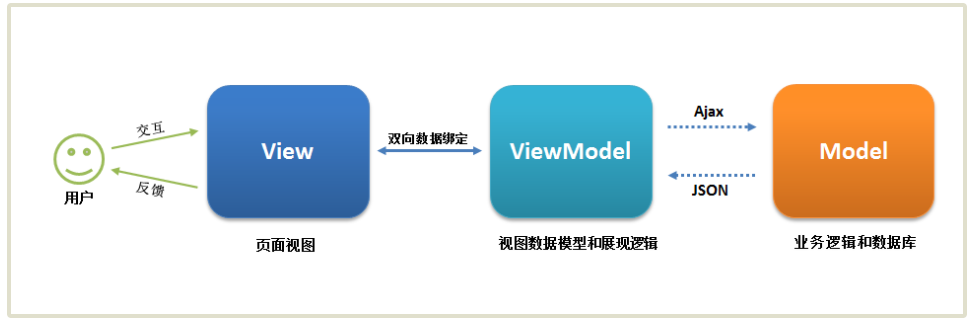
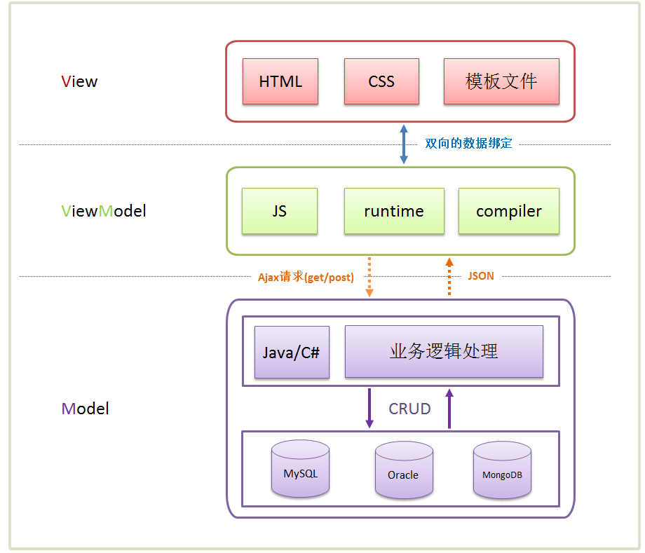
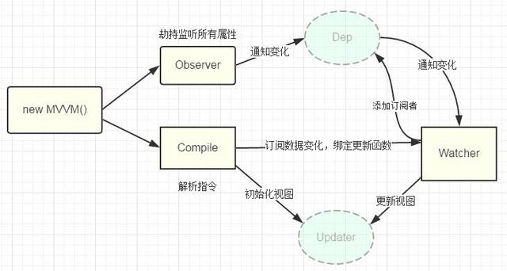

# MVVM框架

### 对MVVM的认识

- MVC
- MVVM的定义
- MVC与MVVM的对比

##### MVC

MVC(model,view,controller)，一种将业务逻辑、数据、界面分离的方法组织代码的框架。在改进界面及用户交互的同时，不需要重写业务逻辑。MVC将传统的输入、处理和输出分离。

- Model：模型，数据保存，比如说数据库的表和记录
- View：视图，数据显示，用户界面
- Controller：控制器，业务逻辑

MVC中，视图可以有多个，在视图中没有真正的处理，视图只作为一种数据输出的形式，一个允许用户操作的平台；模型中的代码可以被多个视图使用；控制器通过接受用户的输入、调用模型、调用视图去完成用户的请求，控制器也不做处理，只做接收请求然后通知相关的模型，再确定用哪个视图来返回数据。

MVC将视图层和业务层分离，很容易改变应用程序的数据层和业务规则，耦合性低且可维护性高。

MVC中的模型可以被不同的视图使用，重用性高。

##### MVVM

MVVM 源自于经典的 Model–View–Controller（MVC）模式（期间还演化出了 Model-View-Presenter（MVP）模式，可忽略不计）。MVVM 的出现促进了 GUI 前端开发与后端业务逻辑的分离，极大地提高了前端开发效率。MVVM 的核心是 ViewModel 层，它就像是一个中转站（Value Converter），负责转换 Model 中的数据对象来让数据变得更容易管理和使用，该层向上与视图层进行双向数据绑定，向下与 Model 层通过接口请求进行数据交互，起承上启下的作用。

MVVM的各个组成部分：

\# View 层

View 是视图层，也就是用户界面。前端主要由 HTML 和 CSS 来构建，为了更方便地展现 ViewModel 或者 Model 层的数据，已经产生了各种各样的前后端模板语言，比如 FreeMarker、Marko、Pug、Jinja2等等，各大 MVVM 框架如 KnockoutJS，Vue，Angular 等也都有自己用来构建用户界面的内置模板语言。

\# Model 层

Model 是指数据模型，泛指后端进行的各种业务逻辑处理和数据操控，主要围绕数据库系统展开。后端业务处理再复杂跟我们前端也没有半毛钱关系，只要后端保证对外接口足够简单就行了，我请求api，你把数据返出来，咱俩就这点关系，其他都扯淡。

\# ViewModel 层

ViewModel 是由前端开发人员组织生成和维护的视图数据层。在这一层，前端开发者对从后端获取的 Model 数据进行转换处理，做二次封装，以生成符合 View 层使用预期的视图数据模型。需要注意的是 ViewModel 所封装出来的数据模型包括视图的状态和行为两部分，而 Model 层的数据模型是只包含状态的，比如页面的这一块展示什么，那一块展示什么这些都属于视图状态（展示），而页面加载进来时发生什么，点击这一块发生什么，这一块滚动时发生什么这些都属于视图行为（交互），视图状态和行为都封装在了 ViewModel 里。这样的封装使得 ViewModel 可以完整地去描述 View 层。由于实现了双向绑定，ViewModel 的内容会实时展现在 View 层，这是激动人心的，因为前端开发者再也不必低效又麻烦地通过操纵 DOM 去更新视图，MVVM 框架已经把最脏最累的一块做好了，我们开发者只需要处理和维护 ViewModel，更新数据视图就会自动得到相应更新，真正实现数据驱动开发。看到了吧，View 层展现的不是 Model 层的数据，而是 ViewModel 的数据，由 ViewModel 负责与 Model 层交互，这就完全解耦了 View 层和 Model 层，这个解耦是至关重要的，它是前后端分离方案实施的重要一环。

MVVM实现原理：

##### MVC与MVVM的对比

[MVC，MVP 和 MVVM 的图示-阮一峰](http://www.ruanyifeng.com/blog/2015/02/mvcmvp_mvvm.html)