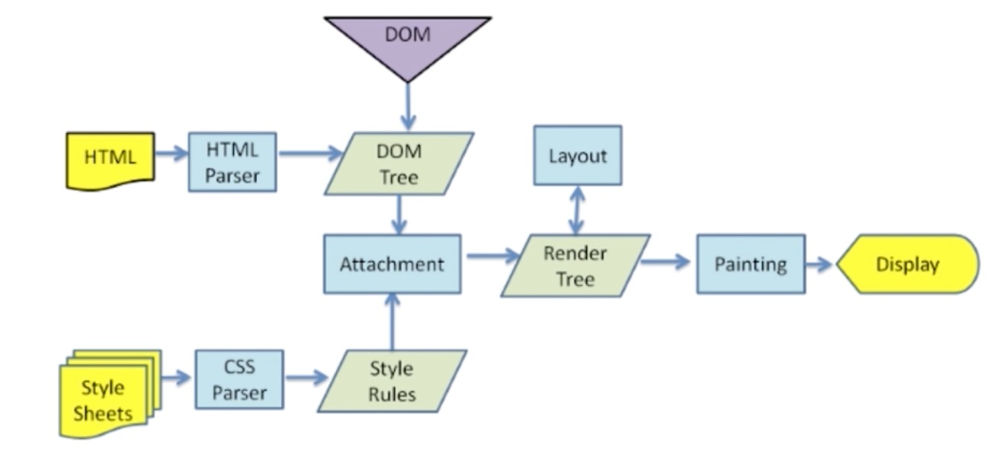
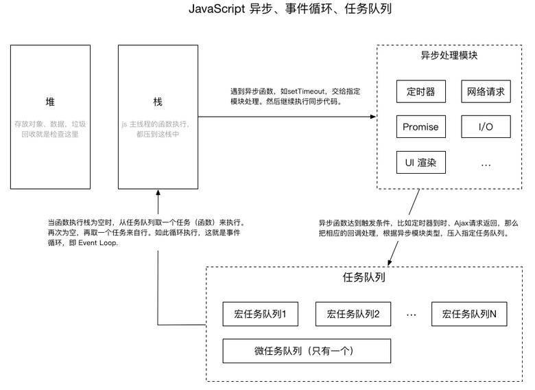

# 前端必备技巧(三)

### 渲染机制

- 什么是DOCTYPE及作用

    DTD(文档类型定义):一系列语法规则，定义XML或(X)HTML的文件类型。浏览器会使用它来判断文档类型，决定使用何种协议来解析，以及切换浏览器模式。 
    
    DOCTYPE：用来声明文档类型和DTD规范，一个主要的用途便是文件的合法性验证。如果文件代码不合法，那么浏览器解析时便会出一些差错。告诉浏览器当前文档包含的是哪个DTD，也就是文档类型。
    
    常见的DOCTYPE：
    - HTML 5	 <!DOCTYPE html>
    - HTML 4 Strict  
        HTML 4 严格模式，该DTD包含所有HTML元素和属性，但不包括展示性和废弃的元素（如font）
    - HTML 4 Transitional    
        HTML 4 传统模式，该DTD包含所有HTML元素和属性，包括展示性和废弃的元素

- 浏览器渲染过程
    
    
    
    1. 当用户输入一个URL，浏览器就会发送一个请求，请求URL对应的资源
    2. HTML解析器会将这个文件解析，构建成一棵DOM树
    3. 构建DOM树时，遇到JS和CSS元素，HTML解析器就将控制权转让给JS或者CSS解析器
    4. JS或者CSS解析器解析完这个元素时候，HTML又继续解析下个元素，直到整棵DOM树构建完成
    5. DOM树构建完之后，浏览器把DOM树中的一些不可视元素去掉，然后与CSSOM合成一棵render树
    6. 接着浏览器根据这棵render树，计算出各个节点(元素)在屏幕的位置。这个过程叫做layout，输出的是一棵layout树
    7. 最后浏览器根据这棵layout树，将页面渲染到屏幕上去

- 重排(Reflow)

    - 定义： DOM结构中的各个元素都有自己的盒子（模型），这些都需要浏览器根据各种样式计算结果将元素放到它该出现的位置，这个过程称之为Reflow
    - 触发条件
        1. 增加、删除、修改DOM节点
        2. 移动DOM的位置，或是制作动画效果
        3. 修改CSS样式
        4. Resize窗口，或是滚动屏幕
        5. 修改网页的默认字体（不推荐，影响性能）

- 重绘(Repaint)

    - 定义：当各种盒子的位置、大小以及其他属性，例如颜色、字体大小等都确定下来后，浏览器把这些元素按照各自的特性绘制一遍，使页面内容出现，这个过程称为Repaint，应尽量减少重绘
    - 触发条件：改动DOM、改动CSS

- 布局(Layout)

### JS运行机制



JS是单线程的，同一时间只能干一件事。    
任务队列：同步任务，异步任务。setTimeout是异步任务，异步任务要挂起；同步任务执行完才回去执行异步任务
```JavaScript
console.log(1);
setTimeout(function () {
    console.log(2);
}, 0);      // 实际上，现代浏览器中最小延迟单位为4ms
console.log(3);
console.log(4);     // 输出：1 3 4 2
```

异步事件：1、setTimeout和setInterval；2、DOM事件；3、ES6中的Promise

### 页面性能

提升页面性能的方法有哪些？
1. 资源压缩合并，减少HTTP请求
2. ==非核心代码异步加载 -> 异步加载的方式 -> 异步加载的区别==
3. ==利用浏览器缓存 -> 缓存的分类 -> 缓存的原理==
4. 使用CDN
5. 预解析DNS
    ```HTML
    <!-- HTTPS协议下强制打开a标签预解析 -->
    <meta http-equiv="x-dns-prefetch-control" content="on">
    <!-- 非HTTPS协议下，浏览器默认打开a标签DNS预解析-->
    <link rel="dns-prefetch" href="//host_name_to_prefetch.com">
    ```
##### 异步加载

- 异步加载的方式：1）动态脚本加载；2）defer； 3）async
- 异步加载的区别
    1. defer是在HTML解析完之后才会执行，如果是多个，按照加载的顺序依次执行
    2. async是在加载完之后立即执行，如果是多个，执行顺序和加载顺序无关

##### 浏览器缓存

- 缓存的分类
    1. 强缓存：浏览器不询问服务器，直接使用本地的缓存
        - expires：服务器的绝对时间，与本地时间可能存在偏差
        - cache-control：相对时间，以秒为单位，在3600秒内直接使用缓存。同时具有expires和cache-control时，以cache-control为准
    2. 协商缓存：浏览器发送请求询问服务器是否可以使用本地缓存文件
    
        Last-Modified 与If-Modified-Since都是用来记录页面的最后修改时间。当客户端访问页面时，服务器会将页面最后修改时间通过 Last-Modified 标识由服务器发往客户端，客户端记录修改时间，再次请求本地存在的cache页面时，客户端会通过 If-Modified-Since 头将先前服务器端发过来的最后修改时间戳发送回去，服务器端通过这个时间戳判断客户端的页面是否是最新的，如果不是最新的，则返回新的内容，如果是最新的，则 返回 304 告诉客户端其本地 cache 的页面是最新的，于是客户端就可以直接从本地加载页面了，这样在网络上传输的数据就会大大减少，同时也减轻了服务器的负担。

        Etag可以理解为根据文件内容计算的hash值，ETag常与If-None-Match或者If-Match一起，由客户端发给服务器端询问缓存数据是否有效（内容未被修改）。

### 错误监控

- 前端错误的分类
    - 即时运行错误：代码错误
    - 资源加载错误

- 错误的捕获方式
    - 即时运行错误的捕获
        1. try...catch
        2. window.onerror
    - 资源加载错误
        1. object.onerror
        2. performance.getEntries()
        3. Error事件捕获
    - 延伸：跨域的js运行错误可以捕获吗，错误提示什么，应该怎么处理？    
        可以捕获到错误，错误提示为"Script error",为获取跨域js，处理措施有以下两步：1.在script标签增加crossorigin属性；2.设置js资源响应头Access-Control-Allow-Origin:*   
- 上报错误的基本原理

    - 采用Ajax通信的方式上报（不推荐）
    - 利用Image对象上报，简单，无需第三方库支持（推荐）
        ```JavaScript
        (new Image()).src = 'http://baidu.com/tesjk?r=tksjk';

### MVVM框架

- 了解MVVM框架吗？
- 谈谈你对MVVM的认识？
- 双向绑定是什么原理，可以写出来吗？
- 使用了什么设计模式？
- 生命周期是什么？
- 有看过源码吗？

##### 了解MVVM框架吗？

Vue.js\React.js\Angular.js

注意事项：
1. 一定要想好说哪个
2. 收住优点，攒着下面说，开启引导模式
3. 话别说的太满，低调谨慎

##### 对MVVM的认识

1. 先聊MVC
2. 聊聊MVVM的定义

注意事项：
1. 聊聊MVC，彰显知识面涉猎较多（MVVM从MVC演化而来，MVC属于MVVM诞生的历史部分）
2. 把MVVM的定义说清楚，表达概念理解到位
3. 对比MVVM和MVC

设计模式：观察者模式
1. 观察者设计模式的原理要了如指掌
2. 最好能写出设计模式的伪代码
3. 如果没有问到设计模式，也要找时机表现出来

##### 生命周期（React）
1. 熟记对应的几个节点
2. 熟记每个节点触发的时机
3. 做好演练

##### 源码（Vue.js）
1. 不要说没看过源码
2. 如果实际没看过，就说看过vue.js源码，大同小异，原理相通