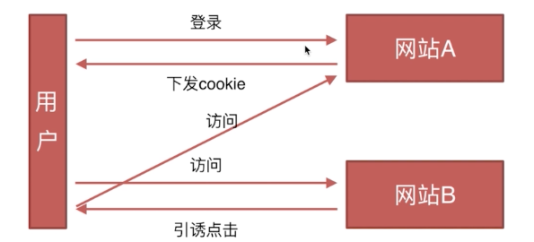

# 前端必备技巧(二)

### 原型链

- 创建对象有几种方法

  ```javascript
    // 第一种方式：字面量
    var o1 = {name: 'o1'};
    var o2 = new Object({name: 'o2'});
    // 第二种方式：构造函数
    var M = function (name) { this.name = name; };
    var o3 = new M('o3');
    // 第三种方式：Object.create
    var p = {name: 'p'};
    var o4 = Object.create(p);
  ```
- 原型、构造函数、实例、原型链

  

  1. 原型中的属性和方法会被实例共有
  2. 函数同时也是对象，也拥有__proto__属性，F.__proto__ === Function.prototype
  3. Js中的对象都有一个__propto__属性，这个是对象的隐式原型，指向该对象的父对象的原型(prototype)
  4. 显示原型对象使用prototype，但是Object.prototype.__proto__ = null

- instanceof的原理

  

  对于someObj instanceof someFunc，JS会获取someFunc.prototype，同时获取someObj._proto_，然后判断someFunc.prototype === someObj._proto_，如果为真，则instanceof返回真，如果为假，则获取someObj._proto_._proto_，然后再判断someFunc.prototype === someObj._proto_._proto_，按照此规则从someObj的原型链中遍历所有的_proto_，一直到Object.prototype，如果在遍历的过程中有_proto_和someFunction.prototype全等，则返回真。
  ```javascript
  function Foo(){...};
  foo = new Foo();
  foo.__proto__ = Foo.prototype

  function A(){...}
  function B(){...}
  B.prototype = new A();
  var b = new B();
  console.log(b instanceof A);    \\ true

  function A(){...}
  function B(){...}
  B.prototype = new A();
  var b = new B();
  A.prototype = new Object();
  console.log(b instanceof A);    \\ false
  ```
- new运算符

  当代码 new Foo(...) 执行时，会发生以下事情：
  1. 一个继承自 Foo.prototype 的新对象被创建
  2.  构造函数 Foo 被执行，执行的时候，相应的参数会被传入，同时上下文 this 会被指定为这个新实例。new Foo 等同于 new Foo() ，只能用在不传递任何参数的情况下
  3. 如果构造函数返回了一个“对象”，那么这个对象会取代整个 new 出来的结果。如果构造函数没有返回对象，那么 new 出来的结果为步骤1创建的对象
      ```JavaScript
      /** 自定义的new方法 */
      var myNew = function(func) {
          var o = Object.create(func.prototype);
          var k = func.call(o);
          if (typeof k === 'object') {
              return k;
          } else {
              return o;
          }
      };
      ```

### 面向对象
- 类的声明

    ```JavaScript
    function Animal() {
        this.name = 'name';
    }
    // ES6
    class Animal2 {
        constructor () {
            this.name = 'name';
        }
    }
    ```
    
- 继承

    对象的继承有两种方式：借助构造函数继承和借助原型链继承
    
    ```JavaScript
    // 借助构造函数实现继承
    function Parent1 () {
        tihs.name = 'parent1';
    }
    Parent1.prototype.say = function () {}; // 不会被Child1继承
    function Child1 () {
        Parent1.call(this); // 也可以用apply，改变函数运行的上下文
        this.type = 'child1';
    }
    
    // 借助原型链实现继承
    function Parent2 () {
        this.name = 'parent2';
    }
    function Child2 () {
        this.type = 'child2';
    }
    Child2.prototype = new Parent2();
    
    // 组合方式 - 最通用的方式
    function Parent3 () {
        this.name = 'parent3';
        this.play = [1,2,3];
    }
    function Child3 () {
        Parent3.call(this);
        this.type = 'child3';
    }
    Child3.prototype = new Parents();
    
    // 组合继承优化1
    function Parent4 () {
        this.name = 'parent3';
        this.play = [1,2,3];
    }
    function Child4 () {
        Parent4.call(this);
        this.type = 'child3';
    }
    Child3.prototype = Parent4.prototype;
    
    // 组合继承优化2
        function Parent5 () {
        this.name = 'parent3';
        this.play = [1,2,3];
    }
    function Child5 () {
        Parent5.call(this);
        this.type = 'child3';
    }
    Child5.prototype = Object.create(Parent5.prototype);
    Child5.prototype.constructor = Child5;
    ```

    1. 借助构造函数实现继承：如果父类的属性都在父类里，则没有问题，如果父类的原型对象上方法，无法继承父类原型上的方法。  
    原理：Parent.call(this);
    2. 借助原型链实现继承：原型链上的原型对象是共用的，实例改变其值，其他实例对应的属性也会。  
    原理：Child2.proptotype = new Parent2();
    3. 组合继承：父类的构造函数执行了两次
    4. 组合优化1：子类实例的构造函数指向了父类，即没有实现父类和子类的原型对象隔离
    5. 组合优化2：实现了子类和父类远行对象的隔离

### 通讯类

- 什么是同源策略及限制

    源包括三个概念：协议、域名、端口(默认80)。同源策略限制从一个源加载的文档或脚本如何与来自另一个源的资源进行交互。这是一个用于隔离潜在恶意文件的关键的安全机制。限制主要在以下方面：
    
    - Cookie、LocalStorage和IndexDB无法读取
    - DOM无法获得
    - AJAX请求不能发送

- 前后端如何通信

    - Ajax：同源下的通讯方式
    - WebSocket: 不受同源策略限制
    - CORS：支持跨域通信，也支持同源通信，是新的通信协议标准

- 如何创建Ajax
 
    - XMLHttpRequest对象的工作流程
    - 兼容性处理
    - 事件的触发条件
    - 事件的触发顺序

- 跨域通信的几种方式

    - JSONP
    
        - 利用Script标签的异步加载实现：动态创建script标签，利用script标签的src属性可以获取任何域下的脚本
        - 缺点：只支持GET
        
    - Hash
    
        场景：当前页面 A 通过 iframe 或 frame 嵌入了跨域页面 B  
        原理：改变hash不会导致页面刷新，可利用loaction.hash来传值，http://a.com#helloword中的'#helloworld'就是location.hash  
        缺点：数据会直接暴露在url中，容量和数据类型都有限制
        ```JavaScript
        // 场景：当前页面 A 通过 iframe 或 frame 嵌入跨域的页面 B
        
        // A 中的伪代码如下
        var B = document.getElementsByTagName('iframe');
        B.src = B.src + '#' + 'data';
        // B 中的伪代码如下
        window.onhashchange = function () {
            var data = window.location.hash;
        }
        ```
    
    - postMessage
    
        postMessage()方法允许来自不同源的脚本采用异步方式进行有限的通信，可以实现跨文本档(iframe)、多窗口、跨域消息传递。
    
    - WebSocket
    
        最大特点：服务器可以主动向客户端推送信息，客户端也可以主动向服务器发送信息，是真正的双向平等对话，属于服务器推送技术的一种。
        
        其他特点：
        1. 建立在 TCP 协议之上，服务器端的实现比较容易。
        2. 与 HTTP 协议有着良好的兼容性。默认端口也是80和443，并且握手阶段采用 HTTP 协议，因此握手时不容易屏蔽，能通过各种 HTTP 代理服务器。
        3. 数据格式比较轻量，性能开销小，通信高效。
        4. 可以发送文本，也可以发送二进制数据。
        5. ==没有同源限制，客户端可以与任意服务器通信。==
        6. 协议标识符是ws（如果加密，则为wss），服务器网址就是 URL。
    
    - CORS：可理解为支持跨域通信的AJAX
    
        整个CORS通信过程，由浏览器自动完成，不需要用户参与。对于开发者来说，CORS通信与同源的AJAX通信没有差别，代码完全一样。浏览器一旦发现AJAX请求跨源，就会自动添加一些附加的头信息，有时还会多出一次附加的请求，但用户不会有感觉。
        
        因此，实现CORS通信的关键是服务器。只要服务器实现了CORS接口，就可以跨源通信。
        
### 安全类

- CSRF（跨站请求伪造，Cross-site request forgery）

    

    原理：引诱点击，冒用Cookie  
    预防：  
    1. Token验证（浏览器会自动添加Cookie，但不会添加Token）
    2. Referer验证，验证请求来源
    3. 隐藏令牌

- XSS（跨域脚本攻击，Cross-site scripting）

    - [攻击原理：注入脚本](http://www.imooc.com/learn/812)     
    - [防御措施：阻止脚本执行](http://www.imooc.com/learn/812)
        1. 过滤（移除用户上传的DOM属性、Style节点、Script节点、Iframe节点等）
        2. 校正（避免直接对HTML Entity解码，使用DOM Parse转换，校正不配对的DOM标签）
