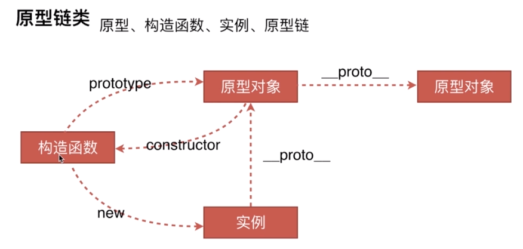
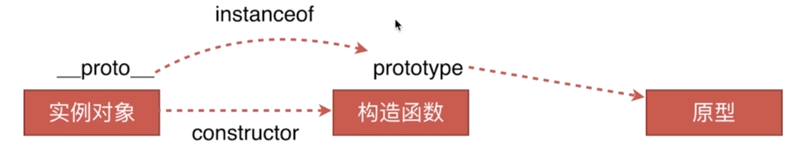

# 前端必备技巧(二)

### 原型链

- 创建对象有几种方法

  ```javascript
    // 第一种方式：字面量
    var o1 = {name: 'o1'};
    var o2 = new Object({name: 'o2'});
    // 第二种方式：构造函数
    var M = function (name) { this.name = name; };
    var o3 = new M('o3');
    // 第三种方式：Object.create
    var p = {name: 'p'};
    var o4 = Object.create(p);
  ```
- 原型、构造函数、实例、原型链

  

  1. 原型中的属性和方法会被实例共有
  2. 函数同时也是对象，也拥有__proto__属性，F.__proto__ === Function.prototype
  3. Js中的对象都有一个__propto__属性，这个是对象的隐式原型，指向该对象的父对象的原型(prototype)
  4. 显示原型对象使用prototype，但是Object.prototype.__proto__ = null

- instanceof的原理

  

  对于someObj instanceof someFunc，JS会获取someFunc.prototype，同时获取someObj._proto_，然后判断someFunc.prototype === someObj._proto_，如果为真，则instanceof返回真，如果为假，则获取someObj._proto_._proto_，然后再判断someFunc.prototype === someObj._proto_._proto_，按照此规则从someObj的原型链中遍历所有的_proto_，一直到Object.prototype，如果在遍历的过程中有_proto_和someFunction.prototype全等，则返回真。
  ```
  function Foo(){...};
  foo = new Foo();
  foo.__proto__ = Foo.prototype

  function A(){...}
  function B(){...}
  B.prototype = new A();
  var b = new B();
  console.log(b instanceof A);    \\ true

  function A(){...}
  function B(){...}
  B.prototype = new A();
  var b = new B();
  A.prototype = new Object();
  console.log(b instanceof A);    \\ false
  ```
- new运算符

  当代码 new Foo(...) 执行时，会发生以下事情：
  1. 一个继承自 Foo.prototype 的新对象被创建
  2.  构造函数 Foo 被执行，执行的时候，相应的参数会被传入，同时上下文 this 会被指定为这个新实例。new Foo 等同于 new Foo() ，只能用在不传递任何参数的情况下
  3. 如果构造函数返回了一个“对象”，那么这个对象会取代整个 new 出来的结果。如果构造函数没有返回对象，那么 new 出来的结果为步骤1创建的对象
      ```JavaScript
      /** 自定义的new方法 */
      var myNew = function(func) {
          var o = Object.create(func.prototype);
          var k = func.call(o);
          if (typeof k === 'object') {
              return k;
          } else {
              return o;
          }
                                      };